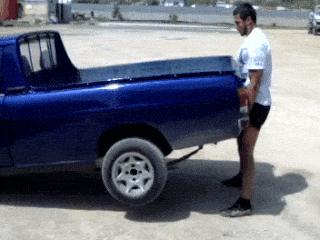
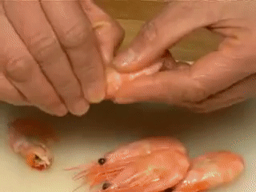
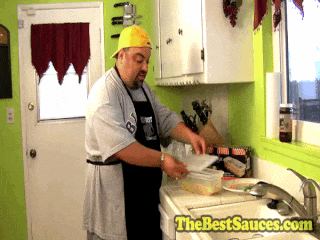

## Sequence to Sequence Video to Text ##

### Testing the model.

Run the shell script `hw2_seq2seq.sh` to download the pre-trained model from [dropbox](https://www.dropbox.com/sh/296jton428kzhpm/AABJwB7JAqD_NAF2y5Dd_inda?dl=0).
This script will download the model, word2index and index2word pickle objects, and testing features (~847.45 MB) and will execute the python code for testing the model.

Command to run the script: `./hw2_seq2seq.sh $1 $2` where $1 is testing data directory and $2 is testset_output.txt

`./hw2_seq2seq.sh testing_data_dir testset_output.txt` : this command will download the pretrained model and execute `test_model.py` with $1 and $2 as parameter. (testing_data_dir must include feat/ and id.txt)

After that, it will execute `bleu_eval.py` with $2 as a parameter.

**Average bleu score is 0.6815**

## Correct descriptions

| `TZ860P4iTaM_15_28.avi`,a cat is playing the piano           | `qvg9eM4Hmzk_4_10.avi`,a man is picking up a car          |
| ------------------------------------------------------------ | --------------------------------------------------------- |
|                         |                    |            
| `04Gt01vatkk_248_265.avi`,a woman is cutting a little onion  | `PeUHy0A1GF0_114_121.avi`,a woman is peeling shrimp       |
|                    |                 |

## Relevant but incorrect descriptions

| `8MVo7fje_oE_125_130.avi`,a man is pouring pasta onto a plate| `J---aiyznGQ_0_6.avi`,a man is playing a piano            |
| ------------------------------------------------------------ | --------------------------------------------------------- |
|                       |                     |
